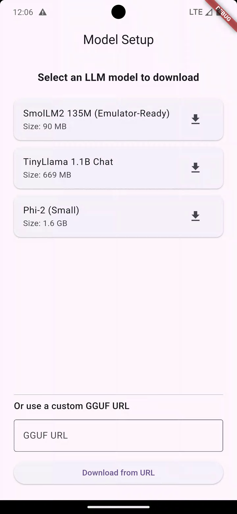
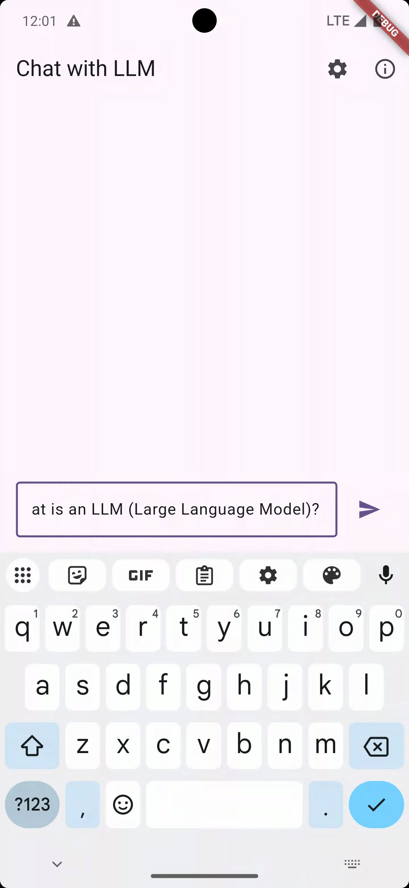
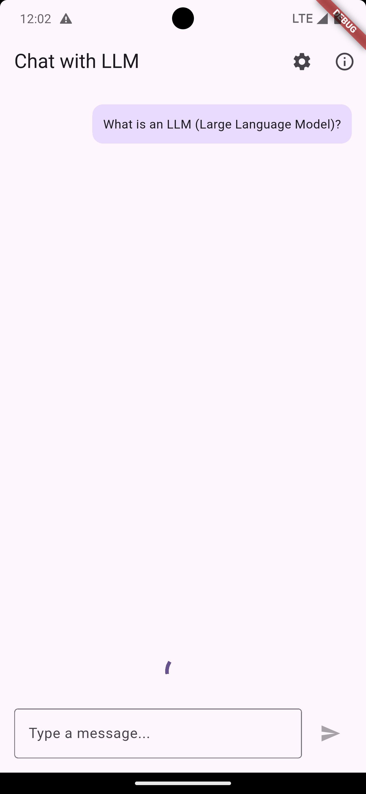
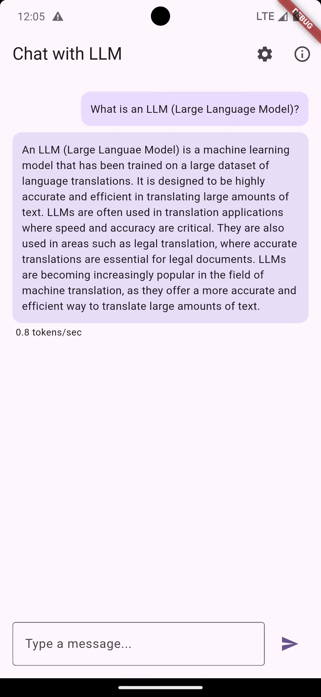
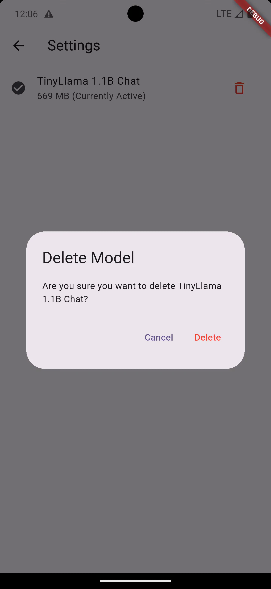

# Flutter AI - Local Moderation

A Flutter application demonstrating on-device LLM inference using `llama.cpp` and Dart FFI.

## Features
- **Zero-Cloud Inference**: Run GGUF models locally on your Android or iOS device.
- **Real-time Streaming**: Tokens are rendered as they are generated for a premium chat experience.
- **Persistent Threading**: High-performance backend worker isolate ensures the UI stays at 60fps.
- **Performance Benchmarks**: Real-time tokens-per-second tracking displayed in-app.

## Model Management
The app handles local GGUF models in the application's documents directory.
- **Directory**: `app_documents_dir/models/`
- **Atomic Downloads**: Models are downloaded with a `.part` extension and renamed only upon success.
- **Storage**: Persistence via `SharedPreferences`.

## Native Integration (`llama.cpp`)
Powered by a custom C++ bridge to `llama.cpp`.

### Android Build
- **Prerequisites**: Android NDK (r25+ recommended) and CMake.
- **Arch**: `arm64-v8a`.
- **Performance**: Uses `mmap` for efficient model loading.

### iOS Build
- **CMake**: The project is configured to generate an iOS Framework.
- **Integration**: To build, open `ios/Runner.xcworkspace` and ensure the `llama_wrapper` target is added as a dependency/framework.
- **FFI**: Uses `DynamicLibrary.process()` for seamless symbol lookup.

## Usage
### Usage
The high-level `LlamaWorker` handles all native interactions:
```dart
final worker = LlamaWorker();
await worker.start();
worker.responses.listen((response) {
  print("Token: ${response.token}");
  if (response.isDone) print("TPS: ${response.tokensPerSecond}");
});
worker.generate(LlamaRequest(
  modelPath: path,
  prompt: prompt,
  requestId: 'example-request',
));
```dart
final result = ModerationParser.parse(rawJson);
final report = ModerationPolicy.apply(result);
print(ModerationPolicy.getDisplayString(report));
```

## Architecture Overview

### Flutter UI Layer
- `ChatScreen`, `ModelSetupScreen`, and `SettingsScreen` provide the UX for downloading GGUFs, configuring the active model, and chatting. They never call native code directly; instead they communicate through `LlamaWorker`.
- `ChatScreen` streams tokens into the UI, preloads models, and tracks request IDs so a late token from the worker cannot corrupt the current conversation.

### Isolate Boundary
- `LlamaWorker` spins up a dedicated Dart isolate for inference. The UI isolate sends `LlamaRequest` objects, and the worker isolate returns `LlamaStreamResponse` events (tokens, errors, TPS stats, warmup notifications).
- The isolate model keeps the UI responsive because all long-running, synchronous native calls happen off the main thread.

### Dart FFI Layer
- `LlamaService` is the high-level Dart façade that mirrors the llama lifecycle: `init` → `preparePrompt`/`getNextToken` → `dispose`.
- `LlamaFfi` owns the `DynamicLibrary` handle (`libllama_wrapper.so` on Android, process image on iOS). It declares native signatures (`typedef ...Native`) and looks up the exported C symbols (`wrapper_init`, `wrapper_prepare_prompt`, etc.), exposing them as type-safe Dart functions.
- FFI (Foreign Function Interface) is what lets Dart call into the native `llama_wrapper` library without a platform channel. Each call marshals data (UTF-8 pointers, ints, bools) across the boundary.

### Native Bridge (`native/llama_cpp`)
- `llama_wrapper.cpp/.h` implement the exported C API that Dart binds to. They:
  - Load GGUF weights via llama.cpp and configure context/thread counts for mobile.
  - Prepare prompts by resetting KV cache, batching tokens, and guarding against context overflow.
  - Stream tokens with sampler chains, explicit stop-sequence checks, and safety limits.
- `llama_wrapper` links directly against the vendored `native/llama_cpp/src` (the official llama.cpp sources) using CMake for Android and CocoaPods for iOS.
- The resulting shared library/framework is bundled with the Flutter app and located via `DynamicLibrary.open('libllama_wrapper.so')` (Android) or `DynamicLibrary.process()` (iOS).

### Data Flow Summary
1. User taps “Send” in `ChatScreen`. The UI pushes a `LlamaRequest` (with prompt, message history, and a unique requestId) into the worker isolate.
2. The worker ensures the correct model is loaded, prepares the prompt via `LlamaService`, and continuously calls `getNextToken` through FFI.
3. Each token is reported back to the UI as a `LlamaStreamResponse`, where `ChatScreen` appends it to the chat and monitors tokens-per-second.
4. When generation finishes (EOS, stop sequence, cancellation, or timeout), the worker sends a final `isDone` response. The UI then resets its state and awaits the next input.

This layered design keeps concerns separated: Flutter widgets handle UX/state, the isolate manages concurrency and prompt budgeting, the Dart FFI layer encapsulates native bindings, and the C++ wrapper deals with llama.cpp internals optimized for on-device inference.

## Final Verdict
I implemented this fully on-device LLM setup in a Flutter app, running locally on an Android phone (Pixel 7). The goal was straightforward: integrate llama.cpp, load a quantized model (~600 MB), and see whether a general chat experience could be delivered reliably without any cloud inference.

From a purely technical perspective, everything worked. The model loaded, prompts were processed, tokens streamed back, and the system behaved correctly under ideal conditions. From a product and engineering perspective, however, the conclusion was unavoidable: this is not production-viable today for general chat on mobile hardware.

Despite aggressive optimization—reduced context windows, limited history, careful batching, memory mapping, and conservative threading—the experience remained highly inconsistent. Most requests timed out or stalled; occasional responses succeeded, but not with the latency or reliability users would tolerate. This wasn’t a configuration mistake or tooling gap. It was a clear illustration of current mobile CPU and memory constraints when running even small LLMs interactively.

The important nuance is that this does not mean on-device inference is pointless. It can work well for tightly bounded tasks such as moderation, classification, or short structured outputs, especially where privacy is critical. What does not work today is trying to replicate a cloud-grade conversational assistant entirely offline on a phone.

The experiment was still a success—because it replaced assumptions with evidence. Sometimes the most valuable engineering outcome is a well-reasoned “**not yet**,” backed by real implementation experience rather than theory.

## Screenshots

### Model Setup


### Empty Chat


### Sending a Prompt


### Streaming Response


### Model Settings


### Delete Confirmation

